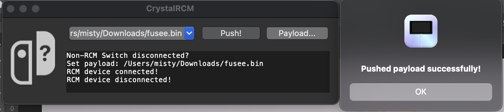

A simple fusee-launcher frontend for macOS (Universal). **Supports macOS >= 10.9.**

 It has libusb statically linked, so you don't need to install anything else to use it.

All credit to Qriad who made the [original launcher](https://github.com/Qyriad/fusee-launcher) - this is merely a frontend.

## Usage

Please note - the app will not work unless you move it outside of the distribution .dmg.

## How to create
.app builds can be found on the release page. You can also build from the repo, if you wish.

1. Make sure you have Xcode installed.
2. Clone the [libusb repository](https://github.com/libusb/libusb).
3. Build the libusb dynamic library according to [their instructions](https://github.com/libusb/libusb/wiki/FAQ#does-libusb-support-apple-sillicon-based-mac).
4. Rename the produced `libusb-....dylib` to `libusb.lib`.
5. Move `libusb.lib` to the `assets/` folder of this repository.
6. `chmod +x create_app.sh`
7. `./create_app.sh`
8. You're done - the app is located in the `dist` subfolder.
