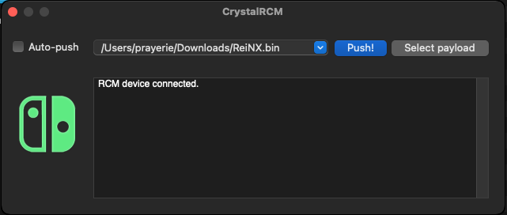

A native port of fusée-launcher with a GUI frontend for macOS (Universal). **Supports macOS >= 10.12.**

It uses native IO libraries, so doesn't require any external downloads.

All credit to Qyriad who made the [original launcher](https://github.com/Qyriad/fusee-launcher) (dead link) - this is just a Swift translation :-).

**note**  there has been a report that paths containing spaces are problematic - apologies for this, will be fixed asap, but in the meantime if you experience this, ensure the payload is not in any folder containing spaces

## Usage

**Issues opening unsigned applications:**

Below is an excerpt from switch.hacks.guide concerning how to open unsigned applications downloaded from the internet:

- *macOS may warn you about the application being downloaded from the internet. To get around this warning, hold the control key while clicking the application, then click Open and Open again.*
- ***macOS Sequoia users:** Apple has changed how unsigned applications from the internet are opened. You will need to follow the instructions [here](https://wiki.hacks.guide/wiki/Open_unsigned_applications_on_macOS_Sequoia) to open the application.*

Please follow the above instructions if you cannot open the app.

Select a payload, and then press 'push'. You can also optionally automatically push on USB connection. A future release will allow the app to run in the background.

The "Push!" button will be disabled if no payload is selected, or if a device in RCM is not detected. To force an attempt, hold shift, which will temporarily override and enable the push button.

Please note - the app may not work unless you move it outside of the distribution .dmg.

## Building

Currently, it will be a bit annoying to build as there are some hardcoded paths in the Xcode project. However, other than that, it should be as simple as opening the project in Xcode and building for yourself.

## How to create (old)

If you wish to build the previous Python release, please switch to the "old" branch and follow the instructions there.

## Contact

If you run into any issues or have any questions, feel free to open an issue here, or contact me on Discord: @prayerie.
